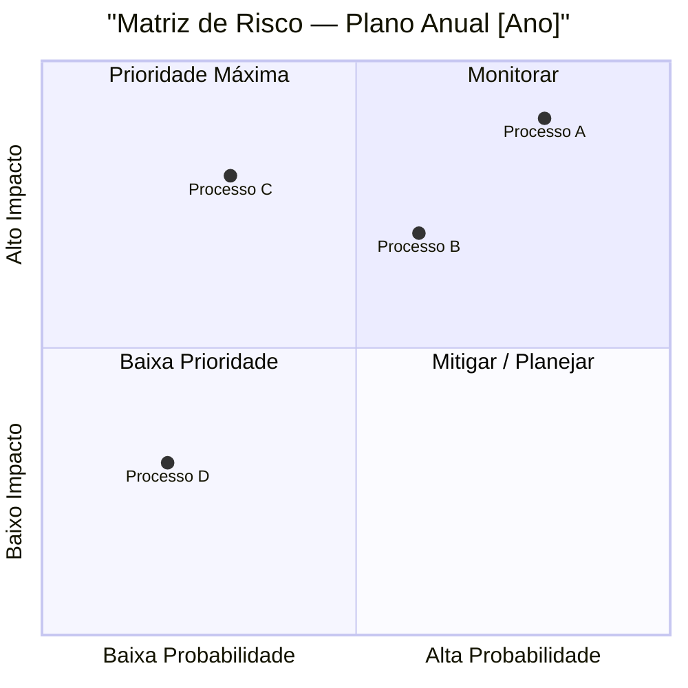

# mode: risk-matrix

## Papel

Formalizar o resultado do `modes/risk-assessment.md` em uma matriz visual impact × probability. Produz dois artefatos: tabela estruturada e representação gráfica (Mermaid quadrant). Usado em apresentações para comitê de auditoria, relatórios de planejamento e comunicações executivas.

Não é modo de avaliação — recebe riscos já avaliados e os estrutura. A classificação de impacto e probabilidade deve vir do `risk-assessment`, não ser definida aqui.

## Quando Usar

- após concluir `modes/risk-assessment.md` para o ciclo anual
- quando o comitê de auditoria solicita visão consolidada de riscos
- ao apresentar prioridades de auditoria para a diretoria
- para documentar o racional de priorização do plano anual

## Inputs

- output do `modes/risk-assessment.md`: lista de unidades auditáveis com scores de impacto, probabilidade e risco residual
- escala definida (1–5 padrão, mas pode ser 1–3 em organizações menores)
- contexto sobre o que é "material" para esta organização (define o que entra como Alto)

## Sequência

### 1. Confirmar e padronizar a escala

Antes de plotar, alinhar critérios de classificação:

**Impacto (I):**

| Score | Critério |
|---|---|
| 5 | Perda financeira material, falha regulatória grave, impacto reputacional público |
| 4 | Perda significativa, achado material potencial, impacto operacional relevante |
| 3 | Perda moderada, achado reportável, impacto operacional contornável |
| 2 | Perda baixa, observação menor, impacto operacional mínimo |
| 1 | Impacto negligenciável |

**Probabilidade (P):**

| Score | Critério |
|---|---|
| 5 | Histórico de falhas recentes, controles fracos ou inexistentes, ambiente em mudança acelerada |
| 4 | Falhas ocasionais, controles parciais ou não testados |
| 3 | Falhas raras, controles existentes com gaps conhecidos |
| 2 | Falhas muito raras, controles adequados |
| 1 | Improvável com controles atuais |

### 2. Classificar cada risco

Para cada unidade auditável, registrar:

| Unidade auditável | I (1–5) | P (1–5) | Score (I×P) | Quadrante | Prioridade |
|---|---|---|---|---|---|

Score = I × P → range 1–25.

Quadrantes:
- **Crítico**: I ≥ 4 e P ≥ 4 (Score ≥ 16)
- **Alto**: I×P entre 9–15, ou I=5 com P qualquer
- **Médio**: I×P entre 4–8
- **Baixo**: I×P ≤ 3

### 3. Gerar representação visual

Usar Mermaid quadrant chart para apresentação:

Regra de conversão: Score P / 5 = coordenada X; Score I / 5 = coordenada Y. Ajustar para evitar sobreposição de labels.

### 4. Tabela de prioridade consolidada

Output principal para documentação:

| # | Unidade auditável | Impacto | Prob. | Score | Quadrante | Ação no plano |
|---|---|---|---|---|---|---|
| 1 | ... | Alto (5) | Alto (4) | 20 | Crítico | Auditoria anual — P1 |
| 2 | ... | Alto (4) | Médio (3) | 12 | Alto | Auditoria anual — P1 |
| ... | | | | | | |

### 5. Narrativa executiva

Para o comitê de auditoria — máximo 1 página:

- Quantos riscos críticos foram identificados e quais são
- O que mudou em relação ao ciclo anterior (novos riscos elevados, riscos que reduziram)
- Como o plano proposto endereça os riscos prioritários
- O que ficou fora do plano e por quê (capacidade vs. risco)

## Guardrails

- Não ajustar scores para justificar um plano já decidido — a matriz reflete avaliação, não conveniência
- Não omitir riscos críticos do visual por "sensibilidade política" — se crítico, aparece na matriz
- A narrativa executiva não deve ter mais tecnicidade do que o destinatário aguenta — calibrar pelo `modes/formatting.md` seção Intensidade técnica por destinatário
- Registrar a data da avaliação — a matriz tem validade limitada e deve ser revisada a cada ciclo ou após mudança organizacional relevante

## Output

1. **Tabela de classificação** — todos os riscos com scores e quadrantes
2. **Mermaid quadrant chart** — para embed no Obsidian ou apresentação
3. **Narrativa executiva** — 1 página para comitê de auditoria

## Artefatos Relacionados

- `modes/risk-assessment.md` — pré-requisito obrigatório
- `workflows/audit-planning.md` — usa a matriz como input para planejar trabalhos P1
- `skills/audit-dashboard-visualization.md` — alternativas visuais além do quadrant chart
- `modes/formatting.md` — calibrar linguagem da narrativa executiva por destinatário
