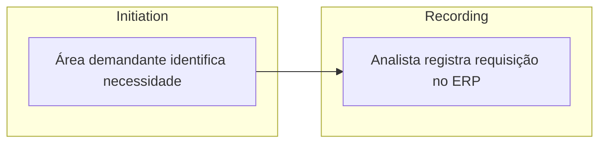
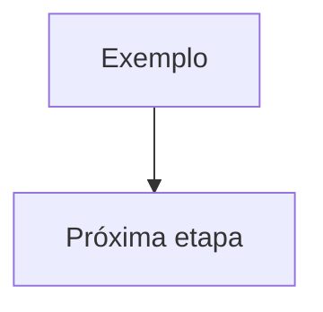

# process-flow-mermaid

## Purpose

Convert audit process descriptions into Mermaid flowcharts that render reliably in Obsidian and remain faithful to the source.

Use this as the visual layer after `walkthrough-standardization`, especially after Mode 3: SCOT table for flowcharting.

## Use When

- a walkthrough, transcript, SCOT table, RCM, or process narrative needs a flowchart
- the user asks for Mermaid, graph TD, flowchart TD, diagram, fluxograma, or visual process flow
- a CoE-style table needs to become a first-pass process diagram
- the output must be reviewed inside Obsidian before any Excel, Bizagi, BPMN, or Python automation

## Inputs

- source process narrative or SCOT table
- desired orientation: `TD` for top-down, `LR` for left-to-right
- process lanes or areas, if known
- decision points and branches, if known
- required output scope: only Mermaid block or Mermaid plus notes

## Conversion Rules

1. Preserve factual content. Do not invent steps, actors, controls, or decisions.
2. Prefer `flowchart TD` unless the user asks for another orientation.
3. Use stable node IDs without spaces or accents: `W01`, `FIN01`, `CTRL01`, `DEC01`.
4. Keep node labels short enough to render.
5. Use subgraphs for actors, areas, phases, or SCOT blocks when they help readability.
6. Write subgraphs as `subgraph FIN["Financeiro"]`, not `subgraph "Financeiro"`.
7. Use decision diamonds for conditions: `DEC01{"Evento de caixa ocorreu?"}`.
8. Use explicit branch labels: `DEC01 -- Sim --> W02`.
9. Preserve accents in labels, but not in IDs.
10. If a connection is unknown, do not guess. Add a node or note labeled `A confirmar`.

## SCOT Mapping

When starting from a SCOT table, group by SCOT only if it improves clarity:

If actors or departments are more important than SCOT, group by lane instead.

## Syntax Guardrails

Before returning, check:

- output starts with a fenced `mermaid` block
- header is `flowchart TD`, `flowchart LR`, `graph TD`, or `graph LR`
- no `mermaidgraph TD`
- no HTML arrows like `--&gt;`
- no `&gt;` or `&lt;` inside edges
- no `subgraph "Title"` syntax
- every opened subgraph has `end`
- every edge references an existing node ID
- labels with line breaks use ` `

## Output

If the user asks only for the diagram, return only:

If the process has material ambiguity, return the Mermaid block and a short `Pontos a confirmar` section.

## Common Mistakes

- Turning a process narrative into a pretty but untraceable diagram.
- Reordering steps only to fit the chart, while changing the process logic.
- Creating controls that should exist instead of controls that were evidenced.
- Using long paragraph labels that make the diagram unreadable.
- Grouping by SCOT when department lanes would make accountability clearer.
