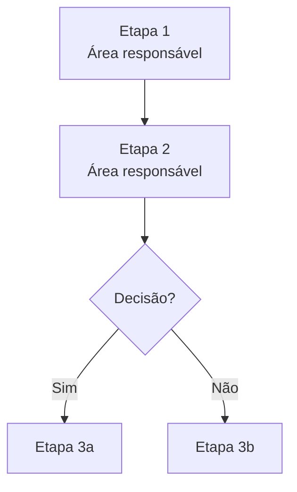

# Walkthrough de Processo — Output Padronizado

> Template da trilha interna. Se o walkthrough precisar seguir `SCOT`, `WCGW`, assertivas e caminho critico ate demonstracoes financeiras, usar `_method-wiki-external-audit/templates/output-walkthrough-external-audit.md`.
> Referência: workflow `walkthrough-standardization.md`. Escolher o formato de saída conforme o uso previsto: narrativa para relatório, mapa de atividades para RCM, Mermaid para embed no Obsidian.

---

## Identificação

| Campo | Valor |
|---|---|
| Cliente / Entidade | |
| Processo / Subprocesso | |
| Módulo / Sistema | |
| Data do walkthrough | |
| Entrevistado(s) | |
| Conduzido por | |
| Versão deste documento | ex: v1.0 — primeira documentação |
| Status | `[ ] Rascunho` `[ ] Em revisão` `[ ] Aprovado` |

---

## Escopo e Objetivo

> O que este walkthrough cobre e para que serve (planejamento, RCM, entendimento inicial, atualização de base anterior).

**Escopo:**

**Objetivo de uso:**
- `[ ] Entendimento inicial do processo`
- `[ ] Base para Risk-Control Matrix (RCM)`
- `[ ] Atualização de walkthrough anterior`
- `[ ] Geração de fluxograma`
- `[ ] Evidência para auditoria`

---

## Formato 1 — Narrativa Padronizada por Objetivo do Processo

> Usar quando o objetivo é relatório legível por gestão, papéis de trabalho formais ou comunicação com cliente.

### Objetivo do processo

### Principais etapas

### Atores, sistemas e handoffs

### Controles identificados e pontos de atenção

---

## Formato 2 — Mapa de Atividades por Responsável

> Usar como base primária para RCM e identificação de WCGWs. Decompõe o processo por quem faz, em qual sistema, com qual input e output.

| # | Atividade | Área / Responsável | Sistema | Input | Output | Ponto de controle esperado |
|---|---|---|---|---|---|---|
| A01 | | | | | | |
| A02 | | | | | | |
| A03 | | | | | | |

**Handoffs identificados:**

**Etapas manuais em alto volume:**

**Decisões sem critério formal:**

---

## Formato 3 — Fluxograma Mermaid

> Usar para embed inline no Obsidian. Gerado a partir do Mapa de Atividades via `skills/process-flow-mermaid.md`.

---

## Atores e Sistemas Identificados

| Ator / Área | Papel no Processo | Sistema utilizado |
|---|---|---|
| | | |
| | | |

---

## Controles Identificados

| # | Etapa (ref.) | Descrição do controle | Tipo | Evidência mencionada |
|---|---|---|---|---|
| C01 | | | `[ ] Preventivo` `[ ] Detectivo` `[ ] Corretivo` | |
| C02 | | | `[ ] Preventivo` `[ ] Detectivo` `[ ] Corretivo` | |

---

## Lacunas e Pontos a Confirmar

| # | Descrição da lacuna | Impacto potencial | Status |
|---|---|---|---|
| L01 | | | `[ ] A confirmar` `[ ] Aceito` `[ ] Resolvido` |
| L02 | | | `[ ] A confirmar` `[ ] Aceito` `[ ] Resolvido` |

---

## Próximos Passos

- `[ ]` Confirmar lacunas com o processo owner
- `[ ]` Usar mapa de atividades como input para `workflows/risk-control-mapping.md`
- `[ ]` Gerar BPMN 2.0 via `skills/process-flow-bpmn.md` se repositório formal necessário
- `[ ]` Validar DoD em `_method-wiki/checklists/audit-artifacts-definition-of-done.md` → seção `1) DoD - Walkthrough`
